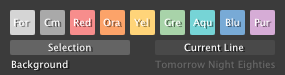
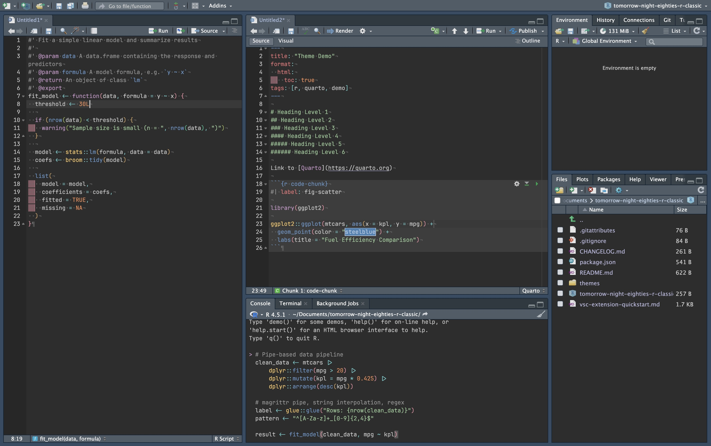
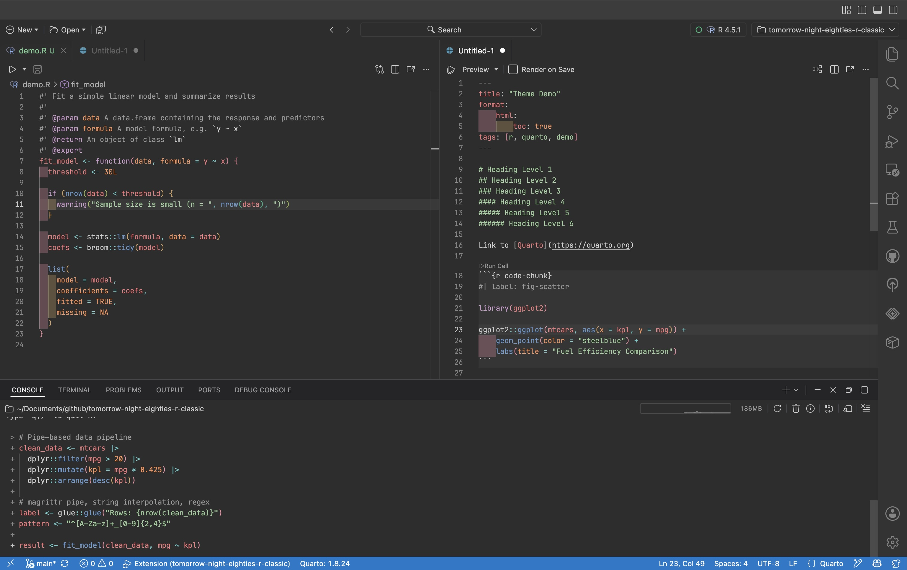
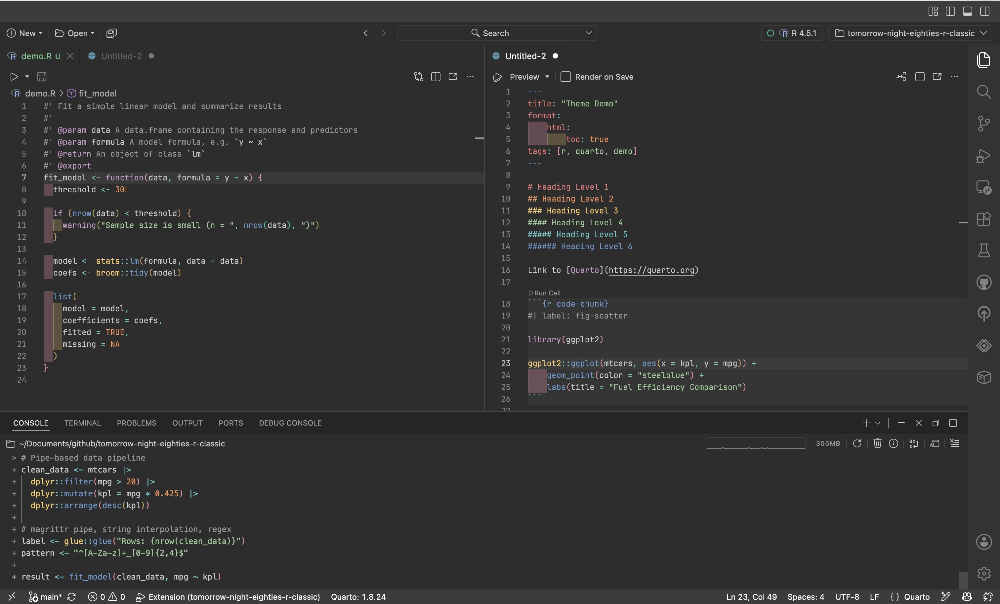

<!-- ```{=html}
<a class="btn btn-primary" href="https://github.com/shelbylevel/tomorrow-night-eighties-r-classic" target="_blank">
  <i class="bi bi-github fs-5"></i>&ensp;GitHub
</a>
``` -->

## My favorite RStudio theme

My favorite color theme in RStudio has always been [Tomorrow Night Eighties](https://github.com/chriskempson/tomorrow-theme/blob/master/textmate/Tomorrow-Night-Eighties.tmTheme). I was drawn in by the way the colors play off the muted, dark grey background as opposed to the traditional stark black background of most dark mode themes. It reminds me of a muted neon sign vibe, like I’m approaching the entrance to an elaborate arcade rather than coding coefficients. I’ve been using it ever since I began learning R about 4 years ago and I don’t see a need to leave the arcade any time soon. Tomorrow Night Eighties is included as a default color theme in RStudio and was originally written by Chris Kempson as one of the variants in the MIT-licensed [Tomorrow theme series](https://github.com/chriskempson/tomorrow-theme).

{fig-align="center" style="border-radius: 4px;"}

Below is an example script in RStudio with the Tomorrow Night Eighties theme enabled showing off a variety of R code elements. The muted background and color palette make it easy to focus on the code without being distracted by the interface.

{fig-align="center" style="border-radius: 4px;"}

Please note that I, like Isabella, have [rainbow parentheses](https://posit.co/blog/rstudio-1-4-preview-rainbow-parentheses) enabled in RStudio. Rainbow parentheses follow their own [color palette developed in R](https://github.com/rstudio/rstudio/blob/3bda5e5a379c033d21408d5393c9daa3176641b2/src/gwt/src/org/rstudio/core/client/theme/res/themeStyles.css#L2735-L2743), independent from the theme itself. I also have [rainbow fills](https://github.com/rstudio/rstudio/pull/11562) enabled, which is an option under indentation guides in RStudio's global options. Rainbow fills follow the same [color palette](https://github.com/rstudio/rstudio/blob/b3d09956d1f025b4f30dee52b81da12c2ef18624/src/cpp/session/resources/themes/tomorrow_night_eighties.rstheme#L736-L757) as rainbow parentheses.

## The problem

When I moved over to [Positron](https://positron.posit.co), I went looking for Tomorrow Night Eighties and what I found was… hard on the eyes. [Microsoft’s port](https://marketplace.visualstudio.com/items?itemName=ms-vscode.Theme-TomorrowKit) of Tomorrow Night Eighties [theme](https://open-vsx.org/extension/ms-vscode/Theme-TomorrowKit) has [workbench](https://code.visualstudio.com/docs/configure/custom-layout#_workbench) or [chrome](https://en.m.wikipedia.org/wiki/Graphical_user_interface#GUI_and_interaction_design) elements that match the RStudio editor color scheme pretty well, however the R syntax highlighting is far from ideal if red and orange aren’t your favorite colors. Here is what the same R script looks like in Positron with Microsoft’s port of Tomorrow Night Eighties enabled:

{fig-align="center" style="border-radius: 4px;"}

It looked nothing like the aesthetically pleasing theme I was used to, suffering from the same excessive amount of syntax highlighting and an especially distracting use of red and orange that Isabella saw in the Tomorrow Night Bright port. So I decided to write my own.

## Inspiration

After being disappointed by the Tomorrow Night Eighties option in Positron I came across [Isabella Velásquez’s post](https://ivelasq.rbind.io/blog/positron-theme/) detailing her similar struggle with the Tomorrow Night Bright theme when adopting Positron and how she went about making her own VS Code color theme extension. With the help of her post I was inspired to write my own theme extension of Tomorrow Night Eighties, because Positron and VS Code users deserve to 

I’m pleased to announce that the resulting extension ‘Tomorrow Night Eighties (R Classic)’ is now available on both the [Open VSX Registry](https://open-vsx.org/extension/shelbylevel/tomorrow-night-eighties-r-classic) for Positron and the [VS Code Extension Marketplace](https://marketplace.visualstudio.com/items?itemName=shelbylevel.tomorrow-night-eighties-r-classic) for VS Code!

Here is the final look:

{fig-align="center" style="border-radius: 4px;"}

## Creating a VS Code color theme extension

Here I followed Isabella’s instructions for creating a VS Code color theme extension, which are detailed in her post. I won’t go into the details here, but I will say that it was a fun and educational experience. This was my first extension, and I’m excited to share my work with the community.

The only things I changed in this section were, of course, the title of the extension and the [Tomorrow Night Eighties' URL](https://raw.githubusercontent.com/chriskempson/tomorrow-theme/refs/heads/master/textmate/Tomorrow-Night-Eighties.tmTheme) to import an existing theme and inline it in the Visual Studio Code color theme file.

I will add Positron's and VS Code's `[Extension Development Host]` feature (open the folder in Positron and press <kbd>F5</kbd>) to my list of favorite features, as it made testing the extension a breeze. I was able to make changes to the theme file and see them reflected in the host window without having to reload the entire application.

## Customizing the extension

While the dated grey/blue workbench elements of the Microsoft port of Tomorrow Night Eighties fit my theme much better than Tomorrow Night Bright, I wanted to make the workbench elements match the muted grey background of the RStudio editor. 

I also wanted to make the syntax highlighting more similar to RStudio’s Tomorrow Night Eighties theme, which meant changing the colors of some of the syntax elements. I was able to do this by modifying the `tokenColors` section of the theme file.

I also have rainbow parentheses enabled by default within the theme.

:::: {.codewindow}
::: {.editor .yaml name="00-load.R"}
```yaml
meta:
  name: shelbylevel
  link: https://www.shelbylevel.org

color:
  palette:
    deep-jade: "#254D56"
    faded-jade: "#45767a"
    faded-jade-50: "#a2bbbd"
    faded-jade-30: "#c7d6d7"
    faded-jade-10: "#ecf1f2"
    gulfstream: "#7fa6ad"
    edgewater: "#d3dfdd"
    edgewater-20: "#dce5e4"
    cascade: "#b3c2c9"
    boulder: "#727E70"
    spring-rain: "#b2c5b4"
    timberwolf: "#D8D5CE"
    timberwolf-50: "#eceae7"
    almond-dust: "#B8AEA8"
    moonstone: "#969996"
    storm-cloud: "#64635E"
    plum-crazy: "#59224A"
  
  foreground: $brand-deep-jade       # main text color
  background: $brand-faded-jade-10     # background
  primary: "#45767a"            # primary brand color
  secondary: "#7fa6ad"          # secondary accent
  tertiary: "#a2bbbd"           # tertiary accent
  success: "#727E70"            # success states
  info: "#b2c5b4"               # info messages
  warning: "#B8AEA8"            # warnings
  danger: "#6f4a64"             # errors/danger
  light: "#ecf1f2"              # light backgrounds
  dark: "#64635E"               # dark elements
```
:::

::: {.editor .yaml name="01-clean.R"}
```yaml
typography:
  fonts:
    - family: "Lato"
      source: google
      weight: [200, 300, 400, 600]
    - family: "Nunito Sans"
      source: google
      weight: [400, 600]
  
  base:
    family: "Lato"
    size: "1rem"
    line-height: 1.6
    weight: 300
  
  headings:
    family: "Nunito Sans"
    style: normal
    weight: 600
    line-height: 1.2
    color: primary
```
:::
::::

## Editor Colors

::: {.panel-tabset}

### Tomorrow Night Eighties (RStudio)

```{r eval=FALSE}
#| echo: false
#| warning: false
tnb_original_tokencolors3 |>
  knitr::kable() |>
  kableExtra::column_spec(1, width = "8em")
```

### GitHub Dark Default

```{r eval=FALSE}
#| echo: false
#| warning: false
gdd_tokencolors3 |> knitr::kable() |> kableExtra::column_spec(1, width = "8em")
```

### Tomorrow Night Eighties (R Classic)

```{r eval=FALSE}
#| echo: false
#| warning: false
tnb_rclassic_tokencolors3 |>
  knitr::kable() |>
  kableExtra::column_spec(1, width = "8em")
```

:::

### Workbench Colors

::: {.panel-tabset}

### RStudio
```{r eval=FALSE}
#| echo: false
#| warning: false
tnb_original_colors |>
  knitr::kable() |>
  kableExtra::column_spec(1, width = "8em")
```

### Microsoft Port

```{r eval=FALSE}
#| echo: false
#| warning: false
gdd_colors |> knitr::kable() |> kableExtra::column_spec(1, width = "8em")
```

### R Classic

```{r eval=FALSE}
#| echo: false
#| warning: false
tnb_rclassic_colors |>
  knitr::kable() |>
  kableExtra::column_spec(1, width = "12em")
```

:::
